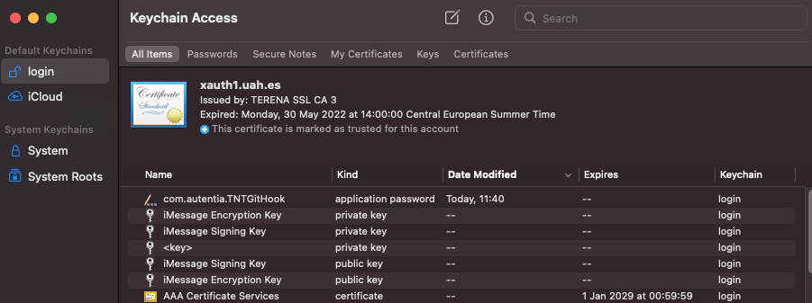
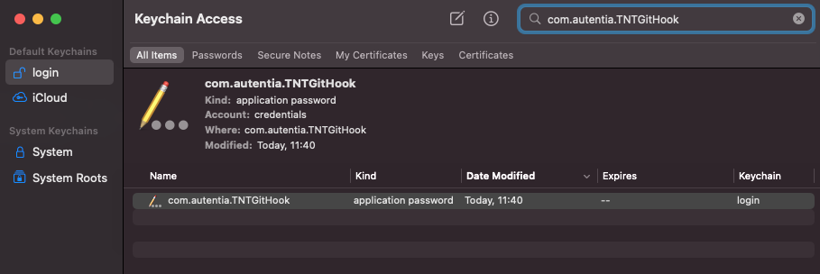
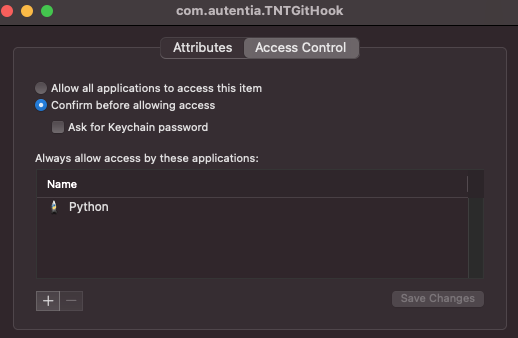
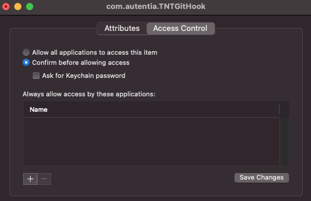

# TNT Git Hook

This is a simple, per project, Git pre push hook, so when you push your commits an auto evidence is created in the associated TNT project.

**If you use this hook you DO NOT NEED to add manualy a photo as evidence!**


### Install

Requirements:
- Python 3.7
- pip3

To check if is already installed in your system you can try to run in the command line: `pip3 --version`

If you need to install them, both can be obtained from python.org or with [homebrew](https://brew.sh/) (recommended!): `brew install python3`

Autentia private Nexus Pypi (package repository) must be added. Edit (or create if needed) the file `~/.config/pip/pip.conf`

```
[global]
index = https://pypi.python.org/pypi/
index-url = https://pypi.python.org/simple/
extra-index-url = https://tnt.autentia.com/nexus/repository/autentia-pypi/simple/
trusted-host = tnt.autentia.com
```

To check the file is properly configured run 

`python3 -m pip config list`

And it should show something like this

```
global.extra-index-url='https://tnt.autentia.com/nexus/repository/autentia-pypi/simple/'
global.index='https://pypi.python.org/pypi/'
global.index-url='https://pypi.python.org/simple/'
global.trusted-host='tnt.autentia.com'
```

To install or upgrade the TNTGitHook utility run the following command:

```bash
python3 -m pip install --upgrade TNTGitHook --user [--break-system-packages]
```

**NOTE**: Use _break-system-packages_ flag in order to avoid _externally-managed-environment_ error when executing the previous command


#### Credentials

Once everything is installed, in order to set TNT login credentials, use the following command:

```bash
python3 -m TNTGitHook --set-credentials
```

Credentials will be secured using system APIs, keychain in macOS, several options on Linux depending on desktop, and whatever security Windows may have. Check https://pypi.org/project/keyring/ for more detail

**VERY IMPORTANT!!**: Secrets stored in the macOS Keychain are accessible with no prompt to any Python script.

This access can be manually revoked (at the cost of manually confirming access each run), following next steps:
1. Open Keychain Access



2. Search com.autentia.TNTGitHook



3. Open it an click on 'Access Control'



4. Delete entry 'Python' and click on 'Save Changes'



### Usage

Once utility is installed, in order to auto imputate on each git push, you must setup the tool by using this command on the root of your git repository.

**This configuration is per git repository!**

```bash
python3 -m TNTGitHook --setup --organization "ORGANIZATION" --project "PROJECT" --role "ROLE"
```

You can also use the setup command without parameters if the file ** .git/hooks/TNTGitHookConfig.json ** exists in your git project directory.
This file should have the following format in order to configure the organization, project and role for the evidence:

```json
{
    "organization": "Some organization",
    "project": "Project",
    "role": "Role"
}
```

### Manual Setup

**Notice: This is what _TNTGitHook --setup_ does under the hood, so you can skip this section.**

Create the following script on `<your-git-project>/.git/hooks/pre-push`

```bash
#!/bin/bash
set -o pipefail

read local_ref local_sha remote_ref remote_sha
$HOME/.tnt/hook/bin/tnt_git_hook $local_ref $local_sha $remote_ref $remote_sha $(git rev-parse --show-toplevel)
```

And give it execution permission:

```bash
chmod +x .git/hooks/pre-push
```

Create this directory in your home directory: `$HOME/.tnt/hook/bin` and create a file `tnt_git_hook.sh`with the following content:
```bash
#!/usr/bin/env bash
set -o pipefail

local_ref=$1
local_sha=$2
remote_ref=$3
remote_sha=$4
project_path=$5

if [ -z "$local_sha" ] || [ -z "$remote_sha" ] || [ $((16#$local_sha)) -eq 0 ]
then
  exit 0
fi

pushd $project_path || exit 1

if [ $((16#$remote_sha)) -ne 0 ]
then
  gitlog_params="$remote_sha..$local_sha"
else
# Remote being created or deleted. For complete information view: https://www.git-scm.com/docs/githooks#_pre_push
# We are going to retrieve the commits only accessible from the current branch (local_ref)
  gitlog_params="$local_ref --not $(git for-each-ref --format='%(refname)' refs/heads/ | grep -v "${local_ref}")"
fi
filename="/tmp/tnt-git-hook-commits-$(date +%s)"
git log --pretty="format:%H;%aI;%an <%ae>;%s" $gitlog_params 1> $filename
git_exit=$?

if [ ! -s $filename ]
then
  # If there aren't commits to push, checks if is a tagged commit and then generate a custom evidence
  tag=$(git tag --points-at $local_sha | xargs)
  if [ -n "$tag" ]
  then
    git log --pretty="format:%H;%aI;%an <%ae>;tag: ${tag}" -1 --no-patch $local_sha 1> $filename
    git_exit=$?
  fi
fi

# Do nothing on error, just inform and go ahead with "git push" (i.e. conflicts)
if [ $git_exit -ne 0 ]
then
  echo "Unable to retrieve git log information, will not create evidence on TNT but push continues"
  rm $filename
  popd
  exit 0
fi

REMOTE=$(git ls-remote --get-url | head -1)

python3 -m TNTGitHook --commit-msgs-file $filename --remote $REMOTE
python_exit=$?

if [ $python_exit -ne 0 ]
then
  echo "Error executing python hook"
  exit 1
fi
rm $filename

popd

```

And give it execution permission:

```bash
chmod +x $HOME/.tnt/hook/bin/tnt_git_hook
```
### Build release (DEPRECATED)

**WARNING: This process has been deprecated. Please use the release GitHub workflow instead!!!**

To build Pypi, modify setup.py accordingly (versions, name, etc) package.
Verify that you don't have old execution folders:
* build/
* dist/
* TNTGitHook.egg-info/

Then execute

```bash
python3 setup.py sdist bdist_wheel
```

To upload to Nexus (you'll need to have twine installed: `pip3 install twine`):

```bash
python3 -m twine upload --repository-url https://tnt.autentia.com/nexus/repository/autentia-pypi/ dist/*
```

If the process fails with this error:
```bash
HTTPError: 400 Bad Request from https://tnt.autentia.com/nexus/repository/autentia-pypi/
Repository does not allow updating assets: autentia-pypi
```
check that you don't have old artifacts in `dist` folder. In that case, delete accordingly.
